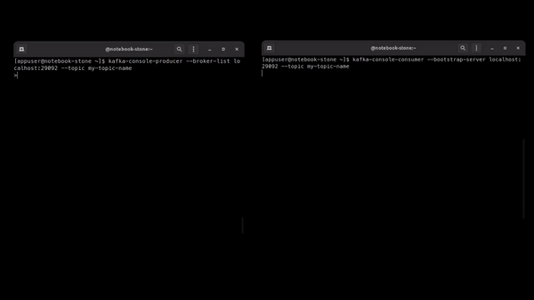

# Kafka Cluster Example

> An example repository on how kafka works.

## **Setup**

Clone This Repository:

```bash
git clone https://github.com/x0n4d0/kafka-cluster-example.git
```

Start Docker Containers:

```bash
docker-compose up -d
```

Open Kafka Container:

```bash
docker exec -it kafka-cluster-example_kafka-1_1 bash
```

## **Kafka Commands**

### Creating One Topic

- My topic will call `my-topic-name`;
- I will set the `replication-factory` to 3, it means this topic will be split into 3 Brokers (redundancy);

```bash
kafka-topics --create --bootstrap-server localhost:29092 --replication-factor 3 --partitions 3 --topic my-topic-name
```

### Listing Created Topics

If you want list your available topics, run:

```bash
kafka-topics --list --bootstrap-server localhost:29092
```

### Connecting To Topic

Producing information for the topic:

```bash
kafka-console-producer --broker-list localhost:29092 --topic my-topic-name
```

Now you can enter any message you want to send to this topic in Kafka.

To read this messages, open new terminal instance and go inside the container again:

```bash
docker exec -it kafka-cluster-example_kafka-1_1 bash
```

Now, run the "Consumer" command to consume this topic:

```bash
kafka-console-consumer --bootstrap-server localhost:29092 --topic my-topic-name
```

When you write any message in the first terminal, you can see the consumer reading the topic.




## **References**

- https://github.com/confluentinc